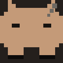
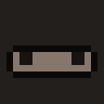

# Tokengotchi

<p align="center">
  
</p>

Um bichinho de estimação que mora num cantinho da sua tela e **se alimenta dos
tokens que você gasta com inteligência artificial**.

Trabalhou bastante hoje com IA? Ele come bem, fica feliz e cresce. Passou o fim de
semana longe do computador? Ele dorme, sente fome e, se você sumir de vez, morre —
aí é só chocar um ovo novo e começar de novo.

Ele conta sozinho: não precisa apontar nada, nem digitar quanto você usou. O app lê
o que as ferramentas de IA já anotam no seu próprio computador. **Nada é enviado
para lugar nenhum** — tudo acontece na sua máquina.

Funciona com **Claude Code**, **Codex CLI**, **Grok CLI** e **Cursor**.
Roda em **Mac, Windows e Linux**.

---

## Como ele reage

O bichinho muda de cara conforme você usa (ou deixa de usar) a IA:

| | | | |
| :---: | :---: | :---: | :---: |
|  |  |  |  |
| **Feliz**<br>barriga cheia | **Comendo**<br>chegou token novo | **Dormindo**<br>20 min parado | **Com fome**<br>começando a esvaziar |
|  |  |  | |
| **Faminto**<br>barriga quase vazia | **Fraco**<br>saúde caindo | **Morto**<br>abandonado demais | |

E cresce em seis fases, conforme o total que já comeu na vida:

| | | | | | |
| :---: | :---: | :---: | :---: | :---: | :---: |
|  |  |  |  |  |  |
| ovo | broto | filhote | jovem | adulto | ancião |

---

## Instalar

Não precisa saber programar. São três passos.

### 1. Baixe o arquivo do seu computador

Vá em **[Downloads (Releases)](../../releases/latest)** e baixe **um** arquivo:

| Se você usa | Baixe o arquivo que termina em |
| --- | --- |
| **Mac** (qualquer um, Intel ou M1/M2/M3/M4) | **`-universal.dmg`** |
| **Windows** | **`-Setup-<versão>.exe`** |
| **Ubuntu / Linux Mint / Debian** | **`_amd64.deb`** |
| **Outro Linux** | **`.AppImage`** |

Os nomes trazem o número da versão (por exemplo `Tokengotchi-0.2.0-universal.dmg`),
que muda a cada lançamento — o que importa é a terminação.

> No Mac é um arquivo só e ele serve para todos os modelos — você não precisa
> descobrir qual processador o seu tem.

### 2. Instale

**No Mac:** abra o arquivo `.dmg` que você baixou. Vai aparecer uma janela com o
bichinho e uma pasta chamada *Applications*. **Arraste o bichinho para cima dessa
pasta.** Pronto, pode fechar a janela.

**No Windows:** dê dois cliques no arquivo `.exe` que você baixou e espere. Ele se
instala sozinho e abre no final. Não faz perguntas.

**No Ubuntu/Debian:** dê dois cliques no arquivo `.deb` e clique em *Instalar*.

**Outro Linux:** clique com o botão direito no `.AppImage` → *Propriedades* →
*Permissões* → marque **"Permitir execução como programa"**. Depois é só dar dois
cliques.

### 3. Na primeira vez, seu computador vai desconfiar

Isso é esperado e **não é vírus**. Acontece porque publicar um app "carimbado" pela
Apple ou pela Microsoft custa uma assinatura anual paga, que este projeto não tem.
O código-fonte está todo aqui nesta página, aberto para qualquer um conferir.

**No Mac**, vai aparecer um aviso dizendo que não foi possível verificar o app.

1. Abra a pasta **Aplicativos**
2. Clique no **Tokengotchi** com o **botão direito** (ou segure `Control` e clique)
3. Escolha **Abrir**
4. No aviso que aparecer, clique em **Abrir** de novo

Só precisa fazer isso **uma vez**. Depois ele abre normalmente com dois cliques.

**No Windows**, pode aparecer uma tela azul escrito *"O Windows protegeu o seu
computador"*.

1. Clique em **Mais informações**
2. Clique em **Executar assim mesmo**

Também só na primeira vez.

### Pronto! E agora?

O bichinho aparece **no canto superior direito da tela** e um ícone dele fica na
barra do sistema (perto do relógio). Ele já começa a comer sozinho conforme você
usa suas ferramentas de IA.

- **Dar um nome a ele:** clique no nome dele no topo da janelinha, digite e
  aperte `Enter`. Também dá pelo menu do ícone, em *Renomear o bichinho…*.
- **A janela sumiu?** Clique no ícone dele perto do relógio e escolha
  *Mostrar bichinho*.
- **Quer que ele abra junto com o computador?** No mesmo menu, marque
  *Abrir no login*.
- **Como fecho de vez?** No mesmo menu, *Sair*. Fechar só a janelinha não desliga
  o bichinho.
- **Saiu versão nova?** Quando houver, aparece uma faixa no rodapé da janelinha
  com o botão *Baixar*. O app não se atualiza sozinho — o botão só abre a página
  de download.

> **Ele não some da barra do sistema?** É de propósito: o Tokengotchi não aparece
> na barra de tarefas nem no Dock, para não atrapalhar. Ele vive perto do relógio.

---

## Atualizando para uma versão nova

O app **não se atualiza sozinho**. Quando sair uma versão nova, é só instalar
por cima — do mesmo jeito que você instalou da primeira vez.

**Seu bichinho não se perde.** O nome, a idade, a saciedade e a geração ficam
guardados numa pasta separada do aplicativo, e instalar por cima não encosta
nela. Você continua com o mesmo bichinho, na mesma fase.

| Sistema | O que fazer |
| --- | --- |
| **Mac** | Baixe o `.dmg` novo e arraste para *Applications* de novo. Ele pergunta se quer substituir — diga que sim. |
| **Windows** | Rode o novo `-Setup-<versão>.exe`. Ele atualiza sozinho, por cima. |
| **Ubuntu/Debian** | Dê dois cliques no `.deb` novo, ou `sudo dpkg -i tokengotchi_<versão>_amd64.deb`. |
| **Outro Linux** | Substitua o `.AppImage` antigo pelo novo. |

**Feche o Tokengotchi antes de instalar** (menu do ícone perto do relógio →
*Sair*), instale, e abra de novo.

Se esquecer e instalar com o app aberto, ele avisa: aparece uma faixa dizendo
que a versão nova está instalada, com um botão *Sair*. Isso acontece porque o
app só deixa uma instância rodar por vez — abrir a versão nova enquanto a antiga
está na bandeja não substitui a que já está no ar. Saia e abra de novo.

Para conferir qual versão está rodando, o número aparece no menu do ícone.

> Para saber qual versão você tem, o número aparece no nome do arquivo que você
> baixou. A versão mais recente está sempre em
> **[Releases](../../releases/latest)**.

---

## Para quem programa

O resto deste README é a parte técnica: como o app lê cada ferramenta, como rodar
a partir do código e como contribuir.

### Compilando do código

Se preferir não baixar um binário pronto — o que é perfeitamente razoável:

```bash
git clone https://github.com/vitorjpr/tokengotchi.git
cd tokengotchi
mise trust && mise install
mise exec -- npm install

mise exec -- npm run dist:mac     # .dmg + .zip (universal)
mise exec -- npm run dist:win     # instalador .exe + .zip (x64 e arm64)
mise exec -- npm run dist:linux   # .AppImage + .deb (x64 e arm64)
```

Os três compilam a partir de qualquer sistema — o electron-builder baixa a
toolchain do NSIS sozinho, então o instalador do Windows sai até de um Mac. Ainda
assim, o caminho mais confiável é deixar o workflow `release.yml` compilar cada
sistema no runner nativo, porque cross-compilar produz o artefato mas não prova
que ele abre.

## Setup com mise

O ambiente é gerenciado por [mise](https://mise.jdx.dev). O `mise.toml` na raiz fixa
o Node LTS 22 (o Electron 43 exige Node 20+).

```bash
mise trust              # só na primeira vez, mise exige confiar no config
mise install            # instala o Node 22 declarado no mise.toml
mise exec -- node --version
```

Tasks disponíveis (`mise tasks` lista todas):

```bash
mise run test           # selftest — não precisa de npm install
mise run doctor         # diagnóstico das fontes, últimas 48h
mise run doctor 720     # últimos 30 dias
mise run start          # sobe o app (alias: mise run dev)
mise run show           # traz a janela de volta se ela sumiu
mise run status         # estado do bichinho em JSON
```

## Rodando

```bash
mise exec -- npm install
mise run start
```

Antes disso, vale rodar o diagnóstico para ver o que o app enxerga na sua máquina:

```bash
mise run doctor         # últimas 48h
mise run doctor 720     # últimos 30 dias
```

Ele lista cada fonte, se o diretório existe, quantos arquivos encontrou e quantos
tokens conseguiu ler. Se alguma linha vier com `✗`, é só ajustar o caminho na config
(veja abaixo) — nada quebra por causa disso.

Para gerar um `.app` de verdade: `mise exec -- npm run dist` (usa electron-builder, baixa ~200 MB na primeira vez).

## Deixando rodando todo dia

No **macOS** e no **Windows**, o menu da bandeja tem **Abrir no login** (checkbox).
Ligado, o sistema sobe o bichinho a cada login, já escondido.

No **Linux** o item não aparece: o Electron não implementa item de login nessa
plataforma, e um checkbox que não faz nada é pior que nenhum. Use o autostart do
seu ambiente — normalmente um `.desktop` em `~/.config/autostart/`.

Um detalhe importante: rodando via `mise run start`, o item de login aponta para o
binário do Electron dentro de `node_modules/` — se você apagar ou reinstalar as
dependências, ele quebra. Para uso diário de verdade, gere o pacote:

```bash
mise exec -- npm run dist:mac     # ou dist:win / dist:linux
```

…instale o resultado no lugar definitivo (`/Applications` no macOS, uma pasta fixa
no Windows) e ligue o **Abrir no login** a partir dele.

### Só uma instância por vez

O app segura um *single instance lock*. Abrir de novo enquanto já existe um rodando
não cria um segundo processo — apenas revela a janela do que já está no ar. Isso
evita dois processos disputando a porta 4736 e escrevendo no mesmo `cursors.json`,
o que corromperia a contagem em silêncio.

### Perdeu a janela?

Ela não aparece no Dock nem na barra de tarefas, então some de vez quando você
esconde ou minimiza. O ícone da bandeja é o caminho normal de volta (**Mostrar
bichinho**), mas numa tela larga ele é fácil de perder. Pelo terminal:

```bash
mise run show
```

## Como ele come

Cada token vale um número de calorias diferente, na mesma proporção do custo real:

| token | peso |
| --- | --- |
| saída | 4× |
| entrada | 1× |
| escrita de cache | 1,25× |
| leitura de cache | 0,1× |

- 4.000 calorias = 1 ponto de saciedade (de 0 a 100)
- Sem comer, perde 5 pontos de saciedade por hora → ~20h para esvaziar
- Barriga vazia, perde 8 pontos de saúde por hora → mais ~12h até morrer
- Acima de 50 de saciedade, recupera 6 pontos de saúde por hora
- 20 minutos sem token nenhum e ele dorme

Na prática: uma sessão decente de Claude Code enche a barriga. Um fim de semana
inteiro sem abrir o terminal mata o bicho. Quando morre, o botão laranja choca um
novo ovo e a geração sobe.

O tempo passa mesmo com o app fechado — ele calcula o decaimento pelo relógio ao abrir,
com teto de 7 dias.

### Geração

O número ao lado do nome (`·1`, `·2`, …) é a **geração**: quantos bichinhos já
passaram por aí. Ele começa em 1 e sobe toda vez que um morre e você choca um ovo
novo. Não é um identificador fixo do bichinho atual.

### Nome

O bichinho nasce como *Tokengotchi* e pode ser renomeado a qualquer momento:
clique no nome no alto da janela, ou use *Renomear o bichinho…* no menu da bandeja.
O nome fica salvo no `pet.json` e sobrevive a reinícios.

Nome em branco volta ao padrão. Espaços das pontas são aparados, espaços repetidos
viram um só, quebras de linha viram espaço e o limite é 18 caracteres — a janela
tem 250px e um nome maior estouraria o cabeçalho. Acentos são preservados.
Chocar um ovo novo devolve o nome padrão, porque é outro bichinho.

### Evolução

`ovo → broto → filhote → jovem → adulto → ancião`, por calorias acumuladas na vida
(250k / 2M / 10M / 40M / 150M). A aparência muda em cada estágio, e o bichinho fica
mais pálido conforme a saúde cai.

Ajuste os números em `src/main/pet.js`, no objeto `TUNING`.

## Como ele lê cada ferramenta

| Fonte | O que é lido | Precisão |
| --- | --- | --- |
| Claude Code | `~/.claude/projects/**/*.jsonl`, campo `message.usage` de cada resposta | exata |
| Codex CLI | `~/.codex/sessions/**/*.jsonl`, eventos `token_count` (usa o delta do total acumulado) | exata |
| Grok CLI | `~/.grok/**`, qualquer objeto de usage reconhecível | depende da versão |
| Cursor | mudanças nos arquivos de estado do Cursor (caminho por sistema, ver abaixo) | **estimativa** |

No Codex, `input_tokens` **já inclui** `cached_input_tokens` (convenção da OpenAI:
`total_tokens === input_tokens + output_tokens`), e `reasoning_output_tokens` é
subconjunto de `output_tokens`. O parser desconta o cache do input antes de pesar —
sem isso o cache seria contado duas vezes, e a 1× em vez de 0,1×. O Claude Code é o
oposto: lá os campos são disjuntos. Por isso o Codex tem normalização própria
(`normalizeCodexUsage` em `src/main/sources.js`).

O Cursor não escreve contagem de tokens em disco em formato aberto, então ele é
creditado por atividade: cada alteração detectada nos arquivos de estado vale
~1.800 tokens estimados, no máximo um evento a cada 45s. Se quiser precisão em vez
de estimativa, desligue a fonte na config e use o endpoint abaixo.

Os caminhos do Cursor em `config/default-sources.json` cobrem os três sistemas —
`~/Library/Application Support/Cursor` no macOS, `~/AppData/Roaming/Cursor` no
Windows e `~/.config/Cursor` no Linux. Raízes que não existem são ignoradas em
silêncio, então a mesma config serve para todo mundo. **Só os caminhos de macOS
foram verificados numa máquina real**; os de Windows e Linux seguem a convenção do
VS Code, do qual o Cursor é um fork. Rode `mise run doctor` no seu sistema para
confirmar — se vier `✗`, corrija na config e mande um PR.

A leitura é incremental: o app guarda o offset de cada arquivo, então reiniciar não
faz o bichinho comer duas vezes. E na primeira execução ele só marca a posição atual
dos logs — ninguém nasce com meses de histórico na barriga.

## Alimentando de fora (qualquer ferramenta)

O app sobe um servidor local em `127.0.0.1:4736`:

```bash
curl -s localhost:4736/feed -d '{"source":"grok","input_tokens":800,"output_tokens":1200}'
curl -s localhost:4736/status
curl -s localhost:4736/show      # revela a janela
curl -s localhost:4736/hide      # esconde de novo
```

Se a porta 4736 já estiver ocupada, o app avisa no console e segue comendo dos logs
normalmente — só o servidor fica fora. Dá para mudar em `ingest.port` no `sources.json`.

Tem um atalho em `hooks/feed.sh`:

```bash
chmod +x hooks/feed.sh
./hooks/feed.sh cursor 800 1200
```

Para plugar no Claude Code como hook, em `~/.claude/settings.json`:

```json
{
  "hooks": {
    "Stop": [
      {
        "hooks": [
          { "type": "command", "command": "/caminho/para/tokengotchi/hooks/feed.sh claude-code 0 1500" }
        ]
      }
    ]
  }
}
```

(Não é necessário para o Claude Code — ele já é lido direto do disco. Serve de modelo
para qualquer outro agente que tenha hooks.)

## Aviso de versão nova

Ao abrir, e depois a cada 24h, o app consulta o endpoint público de releases do
GitHub e mostra uma faixa no rodapé da janela se houver versão mais nova. O item
também aparece no menu da bandeja. **Não há atualização automática**: o botão só
abre a página de download.

Essa é a **única** requisição de rede que o app faz. Nada do bichinho é enviado —
nem tokens, nem contagens, nem identificador. O GitHub vê o que veria em qualquer
visita ao site: o seu IP e o User-Agent (`Tokengotchi/<versão>`).

Para desligar, em `sources.json`:

```json
"updates": { "enabled": false, "checkIntervalHours": 24 }
```

Com `enabled: false` nenhuma requisição é feita. Sem rede, atrás de proxy ou com
o GitHub fora do ar, a checagem falha em silêncio e o app segue normal.

Releases marcados como rascunho ou pré-lançamento são ignorados. A comparação é
numérica por campo, não alfabética — `0.10.0` é corretamente maior que `0.9.0`.

## Configuração

Na primeira execução, o app copia `config/default-sources.json` para a pasta de
dados do usuário, que muda conforme o sistema:

| Sistema | Caminho |
| --- | --- |
| macOS | `~/Library/Application Support/Tokengotchi/` |
| Windows | `%APPDATA%\Tokengotchi\` |
| Linux | `~/.config/Tokengotchi/` |

O menu da bandeja tem **Abrir pasta de dados**, que leva direto ao lugar certo.

Edite esse arquivo para ligar/desligar fontes, corrigir caminhos ou mudar a porta.
Junto dele ficam `pet.json` (o bichinho) e `cursors.json` (a posição de leitura dos logs).
Apagar o `pet.json` é o botão de reset definitivo.

## Estrutura

```
src/main/main.js      janela, tray, loop de varredura a cada 8s
src/main/sources.js   leitura incremental dos logs + parsers por ferramenta
src/main/pet.js       fome, saúde, evolução, persistência
src/main/ingest.js    servidor HTTP local (/feed, /status, /show, /hide)
src/main/updates.js   checagem de versão nova (única saída de rede do app)
src/renderer/         a janelinha: pixel art em canvas + medidores
config/               fontes padrão, copiadas para o Application Support na 1ª vez
hooks/feed.sh         atalho para alimentar via hook de qualquer ferramenta
scripts/doctor.js     diagnóstico das fontes
scripts/selftest.js   testes das regras e dos parsers (mise run test)
scripts/make-icon.js  gera build/icon.png a partir de pixel art, sem dependências
scripts/make-sprites.js  renderiza docs/sprites/*.png chamando o sprite.js real
build/icon.png        ícone do app (1024x1024), consumido pelo electron-builder
docs/sprites/         imagens do README, geradas — não editar à mão
mise.toml             Node 22 + tasks do projeto
```

As imagens do README não são desenhos separados: `scripts/make-sprites.js` carrega
o `src/renderer/sprite.js` de verdade e chama o mesmo `draw()` que o app usa, contra
um canvas 2D falso que grava os `fillRect` num buffer. Se o sprite mudar no app, as
imagens mudam junto com `mise run sprites` — elas não têm como divergir do produto.

Nenhuma dependência além do Electron.

## Política de atualização do Electron

O `package.json` usa `^43.4.1`, ou seja, `npm install` pega patches e minors da linha
43 sozinho, mas **nunca troca de major**. Trocar de major é decisão manual.

Isso existe porque ficar parado sai caro. O projeto nasceu no Electron 31 (build de
2024) e, ao ser instalado em 2026, o macOS passou a classificar aquele binário como
malware e apagá-lo logo após a extração — o app simplesmente não abria. O `npm audit`
concordava por outro caminho: todo Electron ≤ 40.10.2 estava marcado como
vulnerabilidade de severidade alta, com dezenas de CVEs.

Recomendação: revisar a major uma vez por trimestre.

```bash
mise exec -- npm audit           # tem que dizer "found 0 vulnerabilities"
mise exec -- npm outdated        # mostra se saiu major nova
```

Ao subir de major, rode `mise run test` e depois `mise run start` e confira as três
coisas que mais quebram entre majors do Electron: a janela sem moldura/transparente,
o ícone da bandeja e o `preload.js` com `contextIsolation`.

## Desenvolvimento

```bash
mise run test           # selftest: parsers, leitura incremental, ciclo de vida
mise run doctor 720     # o que o app enxerga na sua máquina
mise run start          # sobe em modo dev
mise run icon           # regenera build/icon.png a partir da arte em scripts/make-icon.js
mise run sprites        # regenera as imagens do README a partir do sprite.js real
```

O CI (GitHub Actions) roda `mise run test` e `mise run doctor` a cada push e PR.
O selftest não precisa do Electron nem de `npm install` — só de Node.

Ao mexer nos parsers, adicione um caso em `scripts/selftest.js` com o formato **real**
do log (um trecho colado do arquivo de verdade), não com um formato imaginado. Foi
assim que apareceu o bug de contagem dupla do Codex.

### Lançando uma versão

O procedimento está em **[RELEASING.md](RELEASING.md)**. Em resumo: suba a versão
com `npm version`, commite e empurre uma tag `vX.Y.Z` — o GitHub compila nos três
sistemas e publica o release sozinho. Não crie o release pela interface.

## Detalhes chatos

- A janela é sem moldura e arrastável por qualquer parte que não seja botão.
- O app não aparece no Dock nem na barra de tarefas, só na bandeja do sistema. Fechar a janela não mata o processo — use `Sair` no menu da bandeja, ou `mise run show` para trazer a janela de volta.
- O ícone da bandeja é monocromático no macOS (*template image*, que o sistema inverte conforme o tema) e colorido no Windows e no Linux, que não suportam esse recurso e desenhariam um quadrado preto invisível em bandeja escura.
- Seus dados não saem da máquina: a leitura dos logs é local e o servidor só escuta em `127.0.0.1`. A **única** requisição de rede que o app faz é consultar o endpoint público de releases do GitHub para avisar de versão nova — nenhum dado do bichinho é enviado, e dá para desligar (veja *Aviso de versão nova*).
